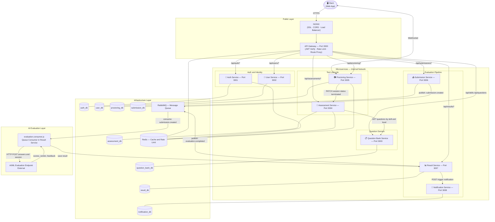

# Architecture Diagram

> **Pattern:** Microservices
> **Stack:** Node.js + Express (per service) | MongoDB (per service) | Redis | RabbitMQ | Socket.io

## System Architecture

## Service Responsibilities

| Service | Port | DB | Responsibility |
|---|---|---|---|
| **API Gateway** | 3000 | — | JWT verification, rate limiting, route proxying to all downstream services |
| **Auth Service** | 3001 | auth_db | Signup, login, JWT issue/refresh/revoke, bcrypt password handling |
| **User Service** | 3002 | user_db | Candidate profile, experience level, skill selection management |
| **Question Bank Service** | 3003 | question_bank_db | Skills catalog, question CRUD (MCQ/technical/coding), difficulty and experience-level filtering |
| **Assessment Service** | 3004 | assessment_db | Test session creation, question assignment, timer state, session lifecycle management |
| **Proctoring Service** | 3005 | proctoring_db | Camera/mic permissions, Socket.io violation events, warning counter, auto-bar trigger |
| **Submission Service** | 3006 | submission_db | Answer ingestion, session validation, idempotency enforcement, queue publish |
| **Result Service** | 3007 | result_db | Consumes evaluation queue, stores AI verdict/scores, serves results to candidate |
| **Notification Service** | 3008 | notification_db | Email/push dispatch for warnings, submission confirmation, result ready alerts |

## Communication Patterns

| Pattern | Between | Used For |
|---|---|---|
| **HTTPS REST** | Client → API Gateway → Services | All user-facing requests |
| **WebSocket (Socket.io)** | Client ↔ Proctoring Service | Real-time violation alerts, live warnings |
| **Internal HTTP (Axios)** | Service to Service | Assessment → Question Bank (fetch questions), Proctoring → Assessment (terminate), Result → Notification (trigger) |
| **Async Queue (RabbitMQ)** | Submission → Result Service via AI | Evaluation pipeline — keeps submission API non-blocking |

## Infrastructure Components

| Component | Purpose |
|---|---|
| **MongoDB x8** | One database per service — full data isolation |
| **Redis** | JWT blacklist (Auth), rate limiting (Gateway), live session timer and warning count (Assessment, Proctoring) |
| **RabbitMQ** | Async message broker for submission to AI evaluation to result pipeline |
| **AWS S3** | Camera violation snapshots (Proctoring), candidate resume uploads (User) |
| **NGINX** | SSL termination, load balancing, reverse proxy to API Gateway |