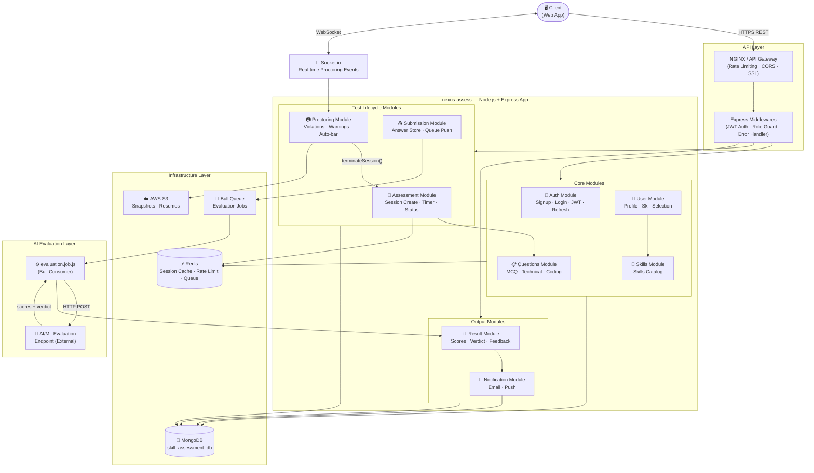

# Architecture Diagram

> **Pattern:** Modular Monolith (Microservices-ready)
> **Stack:** Node.js + Express | MongoDB | Redis | Bull Queue | Socket.io

## System Architecture

## Module Responsibilities

| Module | Responsibility |
|---|---|
| **Auth** | Signup, login, JWT issue/refresh/revoke, password hashing |
| **User** | Profile management, experience level, skill selection |
| **Skills** | Skills catalog CRUD, category management |
| **Questions** | Question bank — MCQ, technical, coding; difficulty & experience-level mapping |
| **Assessment** | Test session creation, question assignment, timer, lifecycle status management |
| **Proctoring** | Camera/mic permission, violation event logging, warning counter, auto-bar trigger |
| **Submission** | Answer collection, session validation, queue push, idempotency enforcement |
| **Result** | Store AI-evaluated scores, verdict, feedback; serve to candidate |
| **Notification** | Email/push dispatch for warnings, submission confirmation, result ready |

## Communication Patterns

| Pattern | Used For |
|---|---|
| **Synchronous REST** | Login, profile, session create, question fetch, result fetch |
| **WebSocket (Socket.io)** | Real-time proctoring alerts, live timer sync |
| **Async Queue (RabbitMQ)** | Submission → AI Evaluation → Result → Notification pipeline |
| **Internal function calls** | Cross-module calls within the monolith (e.g. `assessmentService.terminateSession()`) |

## Infrastructure Components

| Component | Purpose |
|---|---|
| **MongoDB** | Primary data store — all collections in `skill_assessment_db` |
| **Redis** | Active session state (timer, current question), token blacklist, rate limiting, RabbitMQ backing |
| **RabbitMQ** | Async job queue for AI evaluation pipeline (backed by Redis) |
| **AWS S3** | Camera snapshots during proctoring, candidate resume uploads |
| **NGINX** | Reverse proxy, SSL termination, rate limiting at the edge |