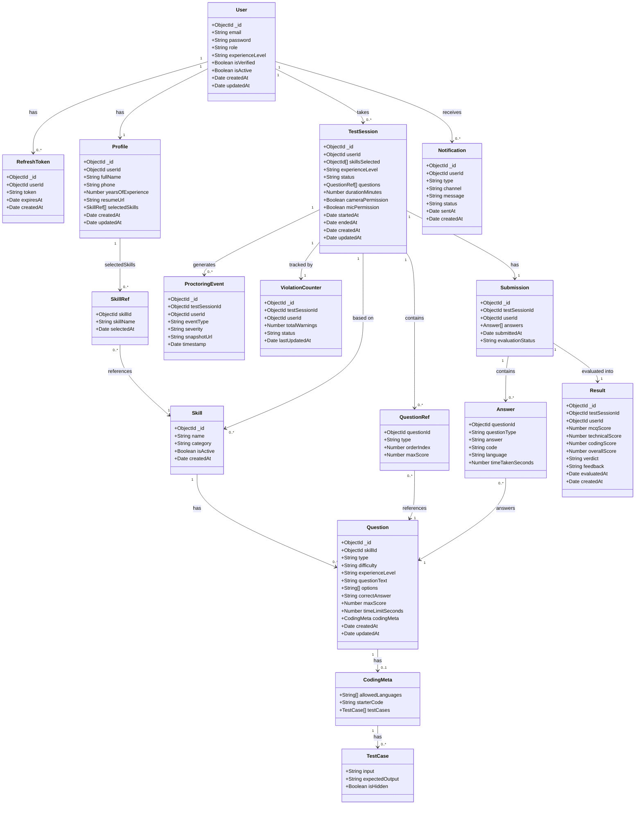

# 🗂️ Class Diagram

> Represents the Mongoose models (collections), their fields, types, and relationships across the `skill_assessment_db` MongoDB database.

## Class Diagram

## Field Type Reference

| Type | Description |
|---|---|
| `ObjectId` | MongoDB document reference (`_id` or foreign key ref) |
| `String` | Text field — enums noted in schema |
| `Number` | Integer or float |
| `Boolean` | true / false flag |
| `Date` | ISO timestamp |
| `[]` | Array of the noted type |

## Enum Values Quick Reference

| Field | Allowed Values |
|---|---|
| `User.role` | `candidate` · `admin` |
| `User.experienceLevel` | `fresher` · `experienced` |
| `Question.type` | `mcq` · `technical` · `coding` |
| `Question.difficulty` | `easy` · `medium` · `hard` |
| `Question.experienceLevel` | `fresher` · `experienced` · `both` |
| `TestSession.status` | `created` · `permission_pending` · `in_progress` · `submitted` · `terminated` · `expired` |
| `ViolationCounter.status` | `active` · `warned` · `barred` |
| `ProctoringEvent.eventType` | `face_not_detected` · `multiple_faces` · `tab_switch` · `noise_detected` · `no_camera` |
| `ProctoringEvent.severity` | `low` · `medium` · `high` |
| `Submission.evaluationStatus` | `pending` · `in_progress` · `completed` · `failed` |
| `Result.verdict` | `pass` · `fail` |
| `Notification.type` | `warning` · `submission_received` · `result_ready` |
| `Notification.channel` | `email` · `push` |
| `Notification.status` | `queued` · `sent` · `failed` |