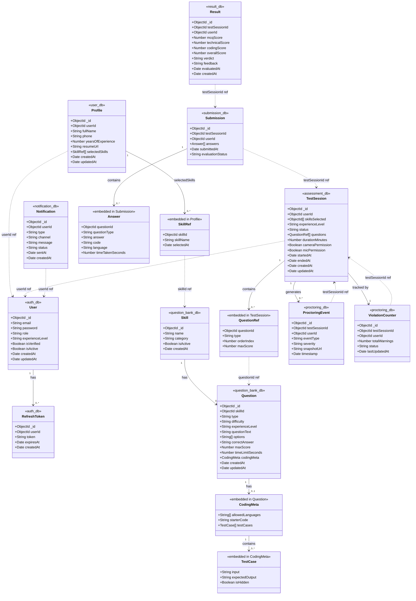

# Class Diagram

> Each service owns its own MongoDB database. Models are grouped by service.
> Cross-service references store the remote `ObjectId` only — no joins, no shared collections.

## Full Class Diagram

## Cross-Service Reference Rules

> Since each service has its own database, these are **reference-only** — no joins happen at the DB level.
> The owning service is responsible for fetching related data via HTTP when needed.

| Reference (stored as ObjectId) | Stored In | Owned By |
|---|---|---|
| `userId` | Profile, TestSession, ProctoringEvent, ViolationCounter, Submission, Result, Notification | Auth Service |
| `skillId` | SkillRef (in Profile), TestSession.skillsSelected | Question Bank Service |
| `questionId` | QuestionRef (in TestSession), Answer (in Submission) | Question Bank Service |
| `testSessionId` | ProctoringEvent, ViolationCounter, Submission, Result | Assessment Service |

## Enum Values Reference

| Model | Field | Allowed Values |
|---|---|---|
| User | role | `candidate` · `admin` |
| User | experienceLevel | `fresher` · `experienced` |
| Question | type | `mcq` · `technical` · `coding` |
| Question | difficulty | `easy` · `medium` · `hard` |
| Question | experienceLevel | `fresher` · `experienced` · `both` |
| TestSession | status | `created` · `permission_pending` · `in_progress` · `submitted` · `terminated` · `expired` |
| ProctoringEvent | eventType | `face_not_detected` · `multiple_faces` · `tab_switch` · `noise_detected` · `no_camera` |
| ProctoringEvent | severity | `low` · `medium` · `high` |
| ViolationCounter | status | `active` · `warned` · `barred` |
| Submission | evaluationStatus | `pending` · `in_progress` · `completed` · `failed` |
| Result | verdict | `pass` · `fail` |
| Notification | type | `warning` · `submission_received` · `result_ready` |
| Notification | channel | `email` · `push` |
| Notification | status | `queued` · `sent` · `failed` |