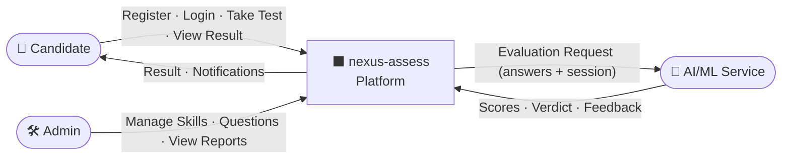
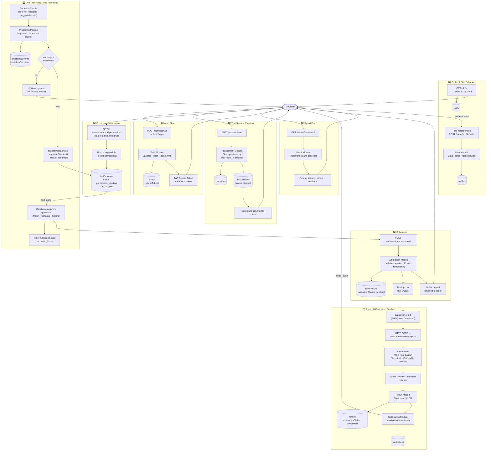
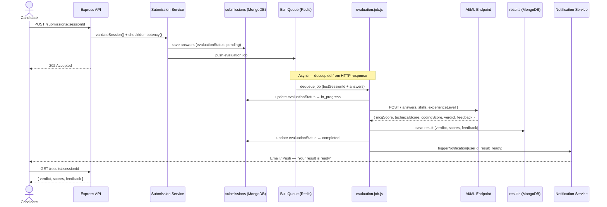
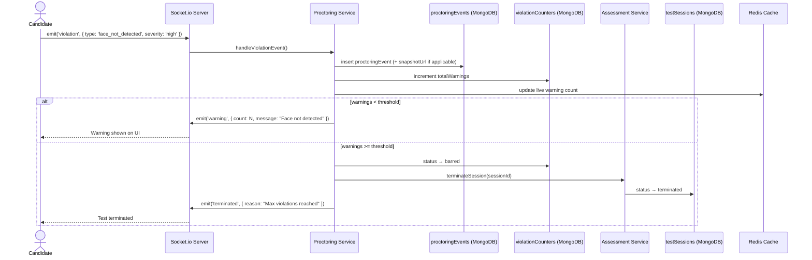

# Data Flow Diagram

> Traces how data moves through the system across all major user journeys — from signup to final result.

## Level 0 — System Context (Bird's Eye View)

## Level 1 — Full Data Flow

## Level 2 — Submission to Result (Zoomed In)

## Level 2 — Proctoring Event Flow (Zoomed In)

## Data Store Responsibilities

| Store | What Lives There |
|---|---|
| **MongoDB** | All persistent data — users, sessions, questions, answers, results, notifications |
| **Redis** | Live session timer, current question index, warning count, JWT blacklist, Bull queue |
| **AWS S3** | Camera snapshots (proctoring), candidate resume files |
| **RabbitMQx** | Async evaluation jobs (backed by Redis, consumed by `evaluation.job.js`) |