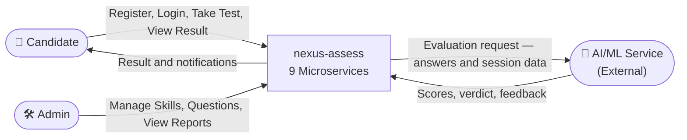
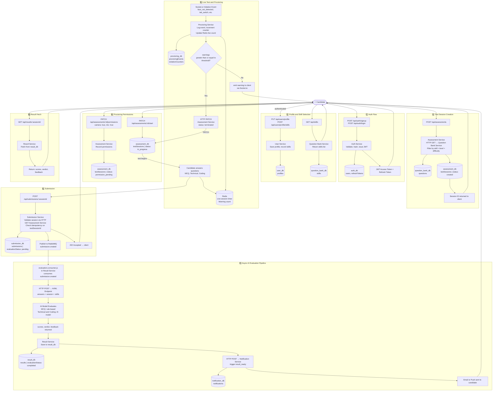
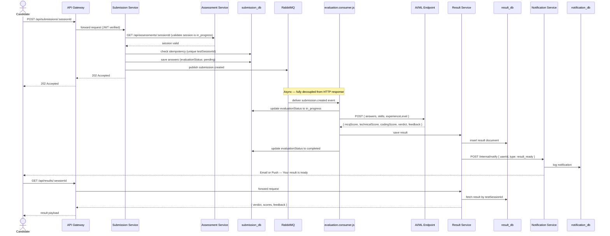
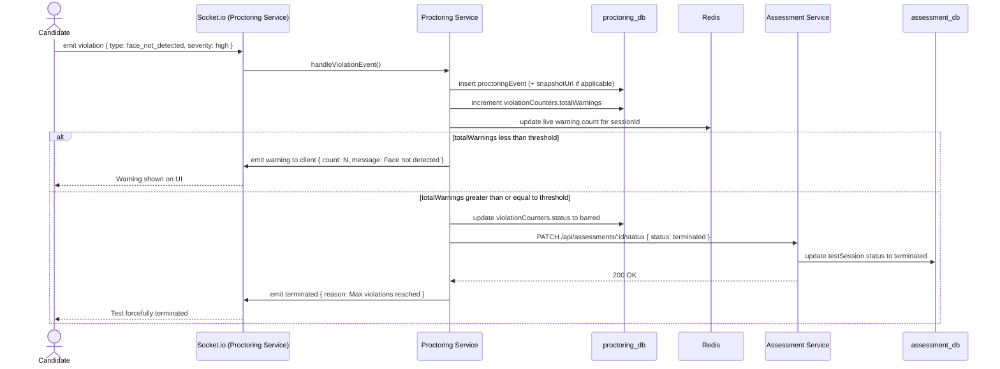

# 🔄 Data Flow Diagram

> Traces how data moves across all 9 services from signup through to final result delivery.

## Level 0 — System Context

## Level 1 — Full End-to-End Data Flow

## Level 2 — Submission to Result (Sequence Diagram)

## Level 2 — Proctoring Violation Flow (Sequence Diagram)

## Data Store Summary

| Store | Owned By | What Lives There |
|---|---|---|
| **auth_db** | Auth Service | users, refreshTokens |
| **user_db** | User Service | profiles (with embedded skill selections) |
| **question_bank_db** | Question Bank Service | skills, questions (with embedded codingMeta and testCases) |
| **assessment_db** | Assessment Service | testSessions (with embedded questionRefs) |
| **proctoring_db** | Proctoring Service | proctoringEvents, violationCounters |
| **submission_db** | Submission Service | submissions (with embedded answers) |
| **result_db** | Result Service | results |
| **notification_db** | Notification Service | notifications |
| **Redis** | Shared Infra | JWT blacklist, rate limit counters, live session timer, live warning counts |
| **RabbitMQ** | Shared Infra | submission.created, evaluation.completed event queues |
| **AWS S3** | Shared Infra | Camera snapshots (Proctoring), resume files (User) |